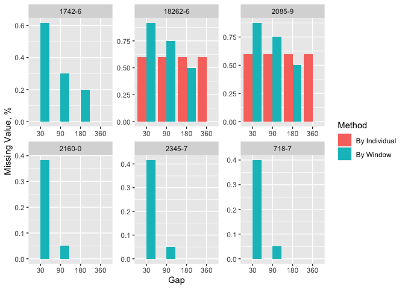

Getting started with lab
================

## lab

For full references, please refer to:
<https://dhlab-tseng.github.io/lab/index.html>

# I. Introduction

The proposed open-source lab package is a software tool that help users
to explore and process laboratory data in electronic health records
(EHRs). With the lab package, researchers can easily map local
laboratory codes to the universal standard, mark abnormal results,
summarize data using descriptive statistics, impute missing values, and
generate analysis ready data.

## Feature

-   **Data Mapping** Standardize and manipulate data with Logical
    Observation Identifiers Names and Codes (LOINC), a common
    terminology for laboratory and clinical observations.
-   **Time Series Analysis** Separate lab test results into multiple
    consecutive non-overlapped time windows
-   **Value Imputation** Impute value to replace missing data
-   **Wide Format Generation** Transform longitudinal data into wide
    format to generate analysis ready data

## Development version

``` r
# install.packages("remotes")
remotes::install_github("DHLab-TSENG/lab")
```

## Overview


## Usage

``` r
# install.packages("remotes")
remotes::install_github("DHLab-TSENG/lab")
library(lab)
```

### Dataset

The sample data includes 1,744 lab records containing 7 different lab
items tested by 5 patients from MIMIC-III database.

``` r
head(labSample)
#>    SUBJECT_ID ITEMID  CHARTTIME VALUENUM VALUEUOM     FLAG
#> 1:         36  50811 2131-05-18     12.7     g/dL abnormal
#> 2:         36  50912 2131-05-18      1.2    mg/dL         
#> 3:         36  51222 2131-05-18     11.9     g/dL abnormal
#> 4:         36  50912 2131-05-19      1.3    mg/dL abnormal
#> 5:         36  50931 2131-05-19    160.0    mg/dL abnormal
#> 6:         36  51222 2131-05-19      9.6     g/dL abnormal
```

### I. Data Mapping

If LOINC is not the default terminology, users are recommended to map
local lab item with LOINC by providing mapping table.

First, user shall prepare a mapping table with local codes and LOINC
codes.

``` r
head(mapSample)
#>    ITEMID                          LABEL FLUID  CATEGORY   LOINC
#> 1:  50811                     Hemoglobin Blood Blood Gas   718-7
#> 2:  50861 Alanine Aminotransferase (ALT) Blood Chemistry  1742-6
#> 3:  50904               Cholesterol, HDL Blood Chemistry  2085-9
#> 4:  50906     Cholesterol, LDL, Measured Blood Chemistry 18262-6
#> 5:  50912                     Creatinine Blood Chemistry  2160-0
#> 6:  50931                        Glucose Blood Chemistry  2345-7
```

``` r
loincSample <- mapLOINC(labData = labSample, labItemColName = ITEMID, mappingTable = mapSample)

head(loincSample)
#>    ITEMID SUBJECT_ID  CHARTTIME VALUENUM VALUEUOM     FLAG      LABEL FLUID
#> 1:  50811         36 2131-05-18     12.7     g/dL abnormal Hemoglobin Blood
#> 2:  50811         36 2131-05-04     12.3     g/dL abnormal Hemoglobin Blood
#> 3:  50811         36 2131-05-15     10.0     g/dL abnormal Hemoglobin Blood
#> 4:  50811         36 2131-05-17     11.7     g/dL abnormal Hemoglobin Blood
#> 5:  50811        109 2142-02-25      6.9     g/dL abnormal Hemoglobin Blood
#> 6:  50811        109 2141-09-20      7.2     g/dL abnormal Hemoglobin Blood
#>     CATEGORY LOINC
#> 1: Blood Gas 718-7
#> 2: Blood Gas 718-7
#> 3: Blood Gas 718-7
#> 4: Blood Gas 718-7
#> 5: Blood Gas 718-7
#> 6: Blood Gas 718-7
```

Once a user map lab test codes with LOINC, ranges can be used to mark
abnormal results, and related names can be used to search related lab
test codes by other common names of a lab test.

``` r
loincMarkedSample <- getAbnormalMark(labData = loincSample, 
                                     idColName = SUBJECT_ID,
                                     labItemColName = LOINC, 
                                     valueColName = VALUENUM, 
                                     genderColName = GENDER,
                                     genderTable = patientSample,
                                     referenceTable = refLOINC)
head(loincMarkedSample)
#>    ITEMID  ID  CHARTTIME Value VALUEUOM     FLAG                          LABEL
#> 1:  50861  36 2131-04-30     8     IU/L          Alanine Aminotransferase (ALT)
#> 2:  50861  36 2131-05-17    12     IU/L          Alanine Aminotransferase (ALT)
#> 3:  50861  36 2134-05-14    12     IU/L          Alanine Aminotransferase (ALT)
#> 4:  50861 109 2138-07-03    14     IU/L          Alanine Aminotransferase (ALT)
#> 5:  50861 109 2142-03-21    46     IU/L abnormal Alanine Aminotransferase (ALT)
#> 6:  50861 109 2142-01-09    10     IU/L          Alanine Aminotransferase (ALT)
#>    FLUID  CATEGORY  LOINC ABMark
#> 1: Blood Chemistry 1742-6   <NA>
#> 2: Blood Chemistry 1742-6   <NA>
#> 3: Blood Chemistry 1742-6   <NA>
#> 4: Blood Chemistry 1742-6   <NA>
#> 5: Blood Chemistry 1742-6      H
#> 6: Blood Chemistry 1742-6   <NA>
```

``` r
caseCreatinine <- searchCasesByLOINC(labData = loincSample,
                                     idColName = SUBJECT_ID,
                                     loincColName = LOINC,
                                     dateColName = CHARTTIME,
                                     condition = "Creatinine",
                                     isSummary = TRUE)

head(caseCreatinine)
#>     ID  LOINC Count firstRecord lastRecode
#> 1:  36 2160-0    37  2131-04-30 2134-05-20
#> 2: 109 2160-0   238  2137-11-04 2142-08-30
#> 3: 132 2160-0    32  2115-05-06 2116-04-08
#> 4: 143 2160-0    60  2154-12-25 2155-10-22
#> 5: 145 2160-0   162  2144-03-29 2145-02-22
```

### II. Time Series Analysis

lab package allows users to separate lab test results into multiple
consecutive non-overlapped time windows. The index date of time windows
can be the first or last event occurred for individuals, or a specific
date for all patients. To help users find suitable window size (e.g., 30
days or 180 days, to name but a few), a plot function is provided to
visualize how frequent the patients did each lab test.

``` r
windowProportion <- plotWindowProportion(labData = loincSample, 
                     idColName = SUBJECT_ID, 
                     labItemColName = LOINC, 
                     dateColName = CHARTTIME, 
                     indexDate = first, 
                     gapDate = c(30, 90, 180, 360), 
                     topN = 5)

print(windowProportion$graph)
```

<!-- -->

``` r
head(windowProportion$missingData)
#>        LAB Gap     Method Proportion
#> 1:  1742-6  30 Missing ID        1.0
#> 2:  1742-6  90 Missing ID        0.4
#> 3:  1742-6 180 Missing ID        0.4
#> 4:  1742-6 360 Missing ID        0.4
#> 5: 18262-6  30 Missing ID        0.6
#> 6: 18262-6  90 Missing ID        0.6
```

After the index date and window size are decided, the descriptive
statistics information, including total test times within a window,
maximum test value, minimum test value, test values average, and the
record nearest to the index date, are shown.

``` r
timeSeriesData <- getTimeSeriesLab(labData = loincSample,
                                   idColName = SUBJECT_ID,
                                   labItemColName = LOINC + CATEGORY,
                                   dateColName = CHARTTIME,
                                   valueColName = VALUENUM,
                                   indexDate = first,
                                   gapDate = 30,
                                   completeWindows = TRUE)
head(timeSeriesData)
#>    ID  LOINC  CATEGORY Window Count Max Min Mean Nearest firstRecord lastRecode
#> 1: 36 1742-6 Chemistry      1     2  12   8   10       8  2131-04-30 2131-05-17
#> 2: 36 1742-6 Chemistry      2    NA  NA  NA   NA      NA        <NA>       <NA>
#> 3: 36 1742-6 Chemistry      3    NA  NA  NA   NA      NA        <NA>       <NA>
#> 4: 36 1742-6 Chemistry      4    NA  NA  NA   NA      NA        <NA>       <NA>
#> 5: 36 1742-6 Chemistry      5    NA  NA  NA   NA      NA        <NA>       <NA>
#> 6: 36 1742-6 Chemistry      6    NA  NA  NA   NA      NA        <NA>       <NA>
```

Also, a line chart plotting function is available to do long-term
follow-up. Visualization is helpful for detecting data trends.
Additionally, “L” and “H” will be used as legendary icon if abnormal
values are marked.

``` r
timeSeriesPlot <- plotTimeSeriesLab(labData = timeSeriesData, 
                                    idColName = ID, 
                                    labItemColName = LOINC + CATEGORY, 
                                    timeMarkColName = Window, 
                                    valueColName = Nearest, 
                                    timeStart = 1, 
                                    timeEnd  = 5, 
                                    abnormalMarkColName = NULL)

plot(timeSeriesPlot)
```

<!-- -->

### III. Imputation

Imputation function can be executed to replace missing data.

``` r
fullTimeSeriesData <- imputeTimeSeriesLab(labData = timeSeriesData,
                                   idColName = ID,
                                   labItemColName = LOINC + CATEGORY,
                                   windowColName = Window,
                                   valueColName = Mean & Nearest,
                                   impMethod = NOCB)
head(fullTimeSeriesData)
#>    ID  LOINC  CATEGORY Window Mean Nearest
#> 1: 36 1742-6 Chemistry      1   10       8
#> 2: 36 1742-6 Chemistry      2   12      12
#> 3: 36 1742-6 Chemistry      3   12      12
#> 4: 36 1742-6 Chemistry      4   12      12
#> 5: 36 1742-6 Chemistry      5   12      12
#> 6: 36 1742-6 Chemistry      6   12      12
```

### IV. Wide Format Generation

Then, a function be used to transform longitudinal data into wide format
to generate analysis ready data.

``` r
wideTimeSeriesData <- wideTimeSeriesLab(labData = fullTimeSeriesData,
                                        idColName = ID,
                                        labItemColName = LOINC + CATEGORY,
                                        windowColName = Window, 
                                        valueColName = Nearest)
head(wideTimeSeriesData)
#>    ID Window 1742-6_Chemistry 18262-6_Chemistry 2085-9_Chemistry
#> 1: 36      1                8                NA               NA
#> 2: 36      2               12                NA               NA
#> 3: 36      3               12                NA               NA
#> 4: 36      4               12                NA               NA
#> 5: 36      5               12                NA               NA
#> 6: 36      6               12                NA               NA
#>    2160-0_Chemistry 2345-7_Chemistry 718-7_Blood Gas 718-7_Hematology
#> 1:              1.0               98            12.3             12.6
#> 2:              1.1               90              NA             11.3
#> 3:              1.2              116              NA             14.5
#> 4:              1.2              116              NA             14.5
#> 5:              1.2              116              NA             14.5
#> 6:              1.2              116              NA             14.5
```
